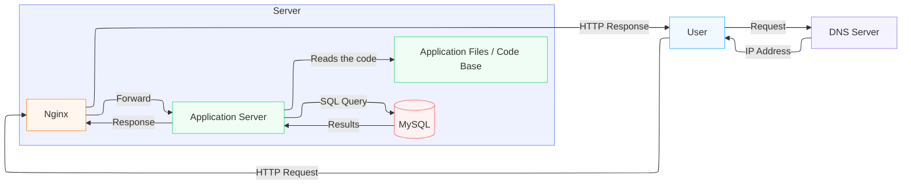

**What is a server?**

A server is a device, a virtual device or computer program for providing functionality for other programs or devices, called "clients".

**What is the role of the domain name ?**

The domain name is therefore a human-readable address that points to an IP address.

**What type of DNS record is www in www.foobar.com ?**

An A record (Address record) directly associates a domain name with an IP address. 

So www.foobar.com → A record → 8.8.8.8.

**What is the role of the web server ?**

Nginx can serve static files (images, CSS, JS) directly without going through the application server. And for dynamic requests, it forwards them to the application server. 

So the role of Nginx is twofold:

- Serve static files directly
- Forward dynamic requests to the application server

**What is the role of the application server ?**

It executes the application code to process the request, then if necessary it queries the database, and finally it generates a response. 
So the role of the application server is:

- Execute the application code
- Query the database if necessary
- Generate the dynamic response

**What is the role of the database ?**

The database stores and organizes data persistently, and allows it to be retrieved via SQL queries.

**What protocol does the server use to communicate with the user's computer ?**

The server communicates with the user's browser via the HTTP (HyperText Transfer Protocol) protocol.

**What is a SPOF?**

A SPOF (Single Point Of Failure) refers to a critical element of a system whose failure leads to its complete shutdown. This can apply to hardware components, such as a router or a server, or to software components, such as a single database. In other words, a SPOF is a single point of failure that, if it fails, prevents the full operation of the system. It is crucial to minimize the number of SPOFs to ensure service continuity and infrastructure availability.

**Why is having a single server a SPOF?**

Because if the server crashes, then the entire site will be inaccessible, there will be no more Nginx, no more application, and no more database.

**What happens to users when you have to deploy new code and restart Nginx?**

When we have to deploy new code and restart Nginx, then we have to restart everything, and during the restart time, the site is inaccessible for the entire duration of maintenance, even for a few seconds, it can affect users.

**What happens if the site becomes very popular and receives thousands of simultaneous requests?**

If the site receives thousands of simultaneous requests, then it can crash because a single server has limited resources (CPU, RAM, bandwidth). If traffic explodes, the server is overloaded and cannot handle all the requests, so the site slows down or crashes.

And unlike a distributed infrastructure, we cannot simply add a second server to share the load.
