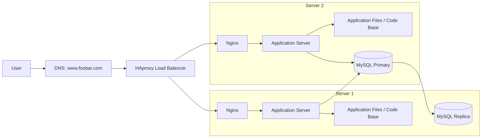

**Three-server web infrastructure for www.foobar.com**

The domain www.foobar.com points to the public IP address of the load balancer. The load balancer receives the client requests and forwards them to one of the two web servers.

**Why each additional element is added**

- HAproxy is added to distribute incoming traffic between the two servers and avoid sending every request to a single machine.
- Nginx is added on each server to serve static content and forward dynamic requests to the application server.
- The application server is added to run the application logic and generate dynamic responses.
- The application files are added because the application server needs the code base to execute the website.
- MySQL is added to store the website data persistently.
- A MySQL replica is added so data can be copied from the primary database for redundancy and read scaling.

**Load balancer algorithm**

HAproxy is configured with a round-robin distribution algorithm. It sends the first request to server 1, the next request to server 2, then back to server 1, and so on. This spreads traffic evenly when both servers have the same role and similar capacity.

**Active-Active or Active-Passive**

This setup is Active-Active at the application tier because both web servers are actively serving traffic at the same time. In an Active-Passive setup, one server handles traffic while the other stays on standby until the active one fails.

**How the Primary-Replica database cluster works**

The primary database accepts writes. It records every change and sends those changes to the replica through replication. The replica stays synchronized with the primary and usually serves read-only queries or acts as a backup target. If the primary fails, the replica can be promoted to become the new primary.

**Primary vs Replica from the application point of view**

- The primary node is the source of truth for writes such as INSERT, UPDATE, and DELETE.
- The replica node is usually read-only and is used for read queries, backup, and failover readiness.
- If the application writes to the replica by mistake, the write will fail or be rejected because the replica is not meant to accept direct changes.

**Issues with this infrastructure**

- Single load balancer: if HAproxy fails, the whole website becomes unavailable.
- Primary database SPOF: if the primary MySQL server fails and failover is not configured, writes stop and the application breaks.
- Nginx or application server failure on one node reduces capacity, and if both servers fail the site goes down.
- No firewall: every service is exposed without network filtering, which increases the attack surface.
- No HTTPS: traffic is sent in clear text, so user data can be intercepted or modified.
- No monitoring: failures, latency spikes, and resource exhaustion may go unnoticed until users report them.

**Summary**

This design improves availability over a single-server setup, but it still contains important SPOFs and security gaps. It is better than the simple stack, but it still needs firewalls, HTTPS, monitoring, and a more resilient database and load balancer design to be production-ready.