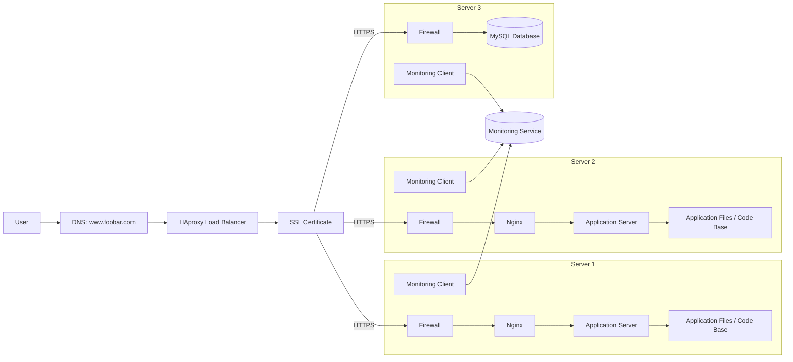

**Three-server secured and monitored web infrastructure for www.foobar.com**

The domain www.foobar.com points to the public IP address of the load balancer. The load balancer receives encrypted client traffic and forwards requests to the appropriate backend server.

**Why each additional element is added**

- HAproxy is added to distribute requests between the web servers and avoid sending all traffic to one machine.
- The SSL certificate is added so the website can be served over HTTPS and user traffic is encrypted.
- A firewall is added on each server to control which ports and sources are allowed to reach the machine.
- The monitoring clients are added so each server can send metrics and logs to the monitoring platform.
- Nginx is added on the web servers to serve static files and forward dynamic requests to the application server.
- The application server is added to execute the application logic and generate dynamic responses.
- The application files are added because the application server needs the code base to run the website.
- MySQL is added to store website data persistently.

**What firewalls are for**

Firewalls filter incoming and outgoing network traffic. They protect the servers by allowing only the ports that are required for the infrastructure, such as HTTPS, SSH from trusted networks, and the database port only from the application tier when needed.

**Why the traffic is served over HTTPS**

HTTPS encrypts the communication between the user and the infrastructure. This protects credentials, cookies, and other sensitive data from being intercepted or modified while in transit, and it also helps users verify that they are talking to the correct website.

**What monitoring is used for**

Monitoring is used to observe the health and performance of the infrastructure. It helps detect failures, high CPU usage, memory pressure, disk problems, request latency, and service outages before users are heavily impacted.

**How the monitoring tool is collecting data**

Each monitoring client runs on a server and collects data locally, such as system metrics, logs, and service-specific statistics. The client then forwards that data to the monitoring service, such as Sumologic, through the network, usually over an encrypted connection.

**How to monitor web server QPS**

If you want to monitor QPS, you should collect web server request metrics from Nginx or the load balancer and count how many requests are processed per second. This can be done from access logs, built-in status pages, or an exporter that turns request counts into metrics.

**Issues with this infrastructure**

- Terminating SSL at the load balancer is an issue because traffic between the load balancer and the backend servers is no longer encrypted, so internal traffic can be read or altered if the network is compromised. It also makes the load balancer a more critical point of failure.
- Having only one MySQL server capable of accepting writes is an issue because it creates a bottleneck and a single point of failure. If that server goes down, writes stop until failover happens.
- Having servers with all the same components, such as database, web server, and application server on every node, is a problem because it wastes resources, increases complexity, and makes scaling harder. It also increases the attack surface and makes failure analysis more difficult because every node does everything.

**Summary**

This infrastructure is more secure and observable than a basic stack because it adds HTTPS, firewalls, and monitoring, but it still has architectural weaknesses. In particular, SSL termination, database write availability, and duplicated server roles can still create reliability and scalability problems.
