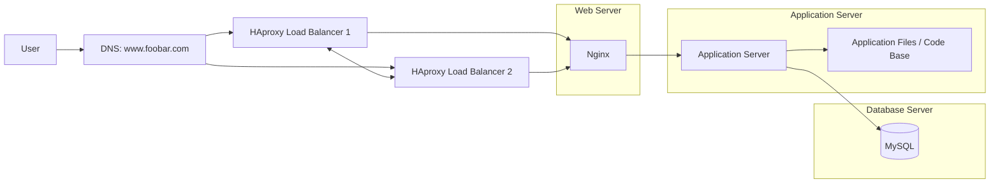

**Scale-up infrastructure for www.foobar.com**

The domain www.foobar.com points to the public IP address of the HAproxy cluster. The cluster receives client requests and forwards them to the web server, which then forwards dynamic requests to the application server and database server.

**Why each additional element is added**

- A second HAproxy load balancer is added so the load balancer layer can run as a cluster and avoid a single point of failure.
- The web server is added on its own server to serve static content and forward application requests.
- The application server is added on its own server to run the application logic separately from the web server.
- The application files are added because the application server needs the code base to execute the website.
- The database server is added on its own server to store website data persistently and isolate storage from the other tiers.

**Web server vs application server**

The web server handles HTTP requests, serves static files, and forwards dynamic requests. The application server executes the business logic, talks to the database when needed, and builds the dynamic response.

**Load balancer algorithm**

HAproxy can use a round-robin algorithm to send requests to the next available web server in the cluster.

**Why the load balancer is a cluster**

Using two HAproxy servers makes the load balancer layer more available. If one load balancer fails, the other one can continue receiving traffic.

**Why split the components**

Splitting the web server, application server, and database onto separate machines improves scalability, makes each tier easier to manage, and reduces contention between unrelated workloads.

**Issues with this infrastructure**

- The database server is still a single point of failure if there is only one MySQL instance.
- The load balancer cluster still needs correct failover and health checks to avoid becoming a bottleneck.
- Splitting the components adds more network hops and more operational complexity.

**Summary**

This scale-up design improves capacity and separation of concerns by using a clustered load balancer and dedicated servers for the web, application, and database tiers.
